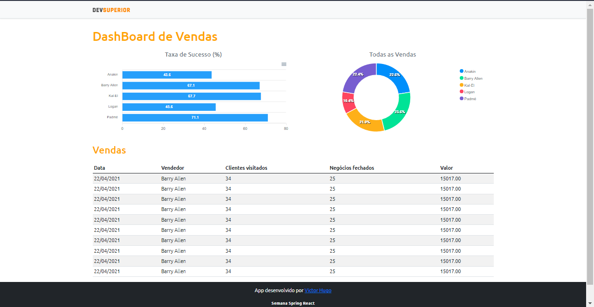

# projeto-sds4

*Programa GNU GPL* usando  JS / TypeScript, PostgreSQL, H2, React.  

### Link App: &nbsp; [VendasWeb](https://dsvendas-victorhugo.netlify.app/) &nbsp;  &nbsp;  &nbsp; Link Código: &nbsp; [frontend](https://github.com/victorhugo9/projeto-sds4/tree/main/frontend) &nbsp;  &nbsp;  &nbsp; 

 

*Projeto de Victor Hugo*
 
&nbsp;&nbsp;&nbsp;&nbsp;&nbsp;&nbsp;&nbsp;&nbsp;&nbsp;[victor.hugolk10@gmail.com](mailto:victor.hugolk10@gmail.com)
